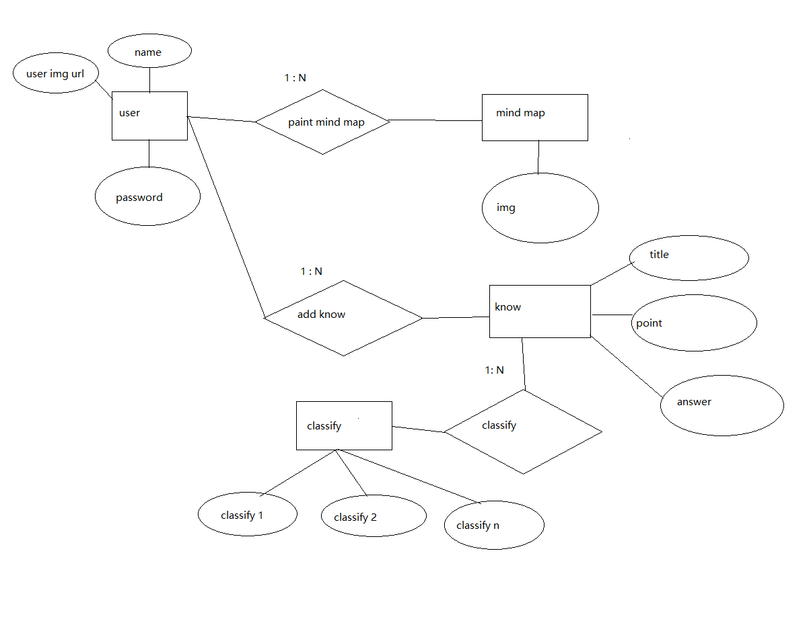

# app数据库配置

## 创建数据库mathapp
create database mathapp;

## 添加用户

grant select,insert,update on mathapp.* to shiwei@"%" identified by "shiwei321";

## 创建mathapp表

ER图

users表, userID是key
| 名字 | 类型 | 长度 |
| --- | ----  | ---- |
| name | varchar | 128 |
| password | varchar | 128 |
| icourl | varchar | 128 |

iconurl 保存格式 static/img/userID.ico

CREATE TABLE `users` ( `name` VARCHAR(128) NOT NULL , `password` VARCHAR(128) NOT NULL );

mindMap表 将图片路径存储在数据库中,因为和users表的 1:N关系，添加一个userID
imgURL为key
| 名字 | 类型 | 长度 |
| --- | ----  | ---- |
| imgURL | varchar | 128 |
| userID | int | 32 |

CREATE TABLE `mindMap` ( `imgURL` VARCHAR(128) NOT NULL , `userID` int(32) NOT NULL );

know表，知识点表结构,因为和users表的 1:N关系，添加一个knowID,title为key
| 名字 | 类型 | 长度 |
| --- | ----  | ---- |
| title | varchar | 128 |
| point | varchar | 128 |
| answer | varchar | 128 |
| userID | int | 32 |
| knowID | int | 32 |

CREATE TABLE `know` ( `title` VARCHAR(128) NOT NULL , `point` varchar(128) NOT NULL, `answer` VARCHAR(128) NOT NULL , `userID` int(32) NOT NULL, `knowID` int(32) NOT NULL );

classify表,先支持8种分类,因为和know表的 1:N关系，添加一个knowID外键
| 名字 | 类型 | 长度 |
| --- | ----  | ---- |
| classify0 | varchar | 128 |
| classify1 | varchar | 128 |
| classify2 | varchar | 128 |
| classify3 | varchar | 128 |
| classify4 | varchar | 128 |
| classify5 | varchar | 128 |
| classify6 | varchar | 128 |
| classify7 | varchar | 128 |
| knowID | int | 32 |

CREATE TABLE `classify` ( `classify0` VARCHAR(128) NOT NULL , `classify1` varchar(128) NOT NULL, `classify2` VARCHAR(128) NOT NULL , `classify3` varchar(128) NOT NULL, `classify4` VARCHAR(128) NOT NULL , `classify5` varchar(128) NOT NULL, `classify6` VARCHAR(128) NOT NULL , `classify7` varchar(128) NOT NULL, `knowID` int(32) NOT NULL);